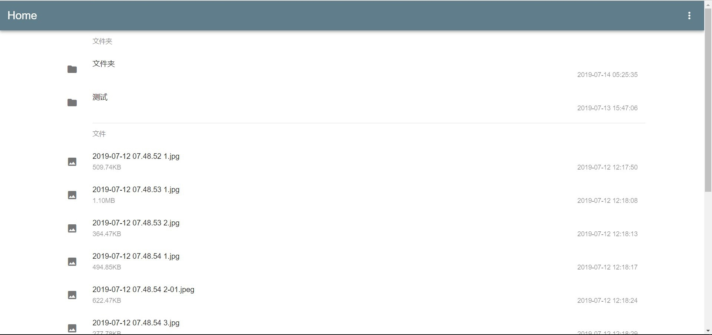
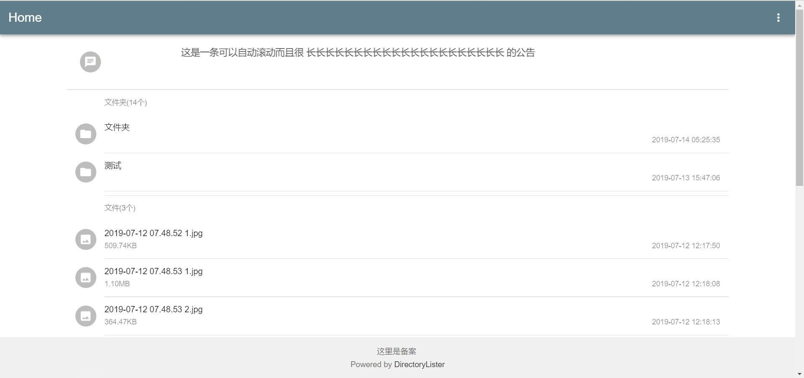

Directory Lister - 简单的 php 文件索引程序(The simple PHP directory lister)
==================================================
Created by, [Chris Kankiewicz](http://www.ChrisKankiewicz.com)

Edited by [Peter1303](https://pdev.top)

介绍(Introduction)
------------

Directory Lister 是一个简单的 PHP 程序，可列出目录及其所有子目录的内容。只需将 Directory Lister 放到一个可以访问的目录就能工作。

本程序结合(This program combines with the secondary development of) <https://github.com/snake-git/DirectoryLister> 二次开发

Directory Lister is a simple PHP script that lists the contents of any web-accessable directory and
allows navigating there within. Simply upload Directory Lister to any directory and get immediate
access to all files and sub-direcories under that directory. 

Directory Lister 是用 php 编写并分发的(Directory Lister is written in PHP and distributed under the) [MIT License](http://www.opensource.org/licenses/mit-license.php).

喜欢这个项目吗？想让它继续下去吗？Like this project? Want to keep it free? [捐献？Make a donation](https://cash.me/$ChrisKankiewicz).

详情 <http://www.directorylister.com>


更新(Update)
--------

  * 支持中文(Support Chinese)
  * 可以设置公告栏(You can set up notice)
  * Material Design 风格

特点(Features)
--------

  * 超容易安装(Extremely simple installation)
  * 创建可访问目录(Creates on-the-fly listing of any web-accessable directory）
  * 自由设置排序(Customizable sort order of files/folders)
  * 还能轻松设置隐藏列表(Easily define hidden files to be excluded from the listing)
  * 可以设置公告栏(You can set up notice)
  * Material Design 风格
  
  |     | 
  | :--------------------------------: |
  |     |


要求(Requirements)
------------

Directory Lister 需要 PHP 5.3+ 才能很好地工作(requires PHP 5.3+ to work properly.  For more information on PHP, please visit)
<http://www.php.net>.


安装(Installation)
------------

  1. 解压后即可(Please decompress the zip)
  2. 如需自定义功能请修改(If you need to customize the function, please edit) ` resources\settings.php `
  3. 如需修改公告请修改(If you need to customize the notice, please edit) ` resources\notice.txt `
  4. 如需添加统计等请修改(If you need to add statistics, please edit) ` resources\footer.php `

文件结构(Structure)
------------

假设你的虚拟主机是 `/home/wwwroot/xxx.xx` 解压后应该是这样子的
``` bash
/home/wwwroot/xxx.xx
├─ resources
│   ├ index.php
│   ├ settings.php
│   ├ config.php
│   ├ footer.php
│   ├ DirectoryLister.php
│   └ notice.ptxt
├ index.php
├ image-normal.jpg
├ image-all.php
└ README.md
```

排除故障(Troubleshooting)
---------------

#### 无法运行

确保安装了目录列表器的最新版本。
验证是否安装了php 5.3或更高版本。您可以通过运行以下命令来验证您的PHP版本：

Ensure you have the latest version of Directory Lister installed.Verify that you have PHP 5.3 or later installed. You can verify your PHP version by running:

    php --version
    
#### 不显示文件和目录

如果安装 `lnmp` 一键包上传 Directory Lister 后，Directory Lister 不显示文件和目录，那么可能是 PHP函数` scandir `被禁用了，取消禁用即可
``` bash
sed -i 's/,scandir//g' /usr/local/php/etc/php.ini
# 取消scandir函数禁用
/etc/init.d/php-fpm restart
# 重启 PHP生效
```

TODO
---------------

  1. 管理员登陆后可上传
  2. 设置密码访问
  3. 可以自定义主题风格

联系原作者(Contact Info)
------------

邮件联系(Contact us via our mailing list at) [Directory-Lister@GoogleGroups.com](mailto:Directory-Lister@GoogleGroups.com)
或者(or) [join our Google Group](https://groups.google.com/forum/?fromgroups#!forum/directory-lister)

在Twitter上关注 Directory Lister(Follow Directory Lister on Twitter at) [@DirectoryLister](https://twitter.com/directorylister) or
关注开发者(follow the developer at) [@PHLAK](https://twitter.com/PHLAK)

发现问题或错误？(Find a problem or bug with Directory Lister?)
[开启提问](https://github.com/DirectoryLister/DirectoryLister/issues) on GitHub.

联系我(Contact Me)
------------

邮件联系(Contact me) [peter13034@outlook.com](mailto:peter13034@outlook.com)

License
-------

Directory Lister is distributed under the terms of the
[MIT License](http://www.opensource.org/licenses/mit-license.php).
Copyright 2017 [Chris Kankiewicz](http://www.chriskankiewicz.com)
